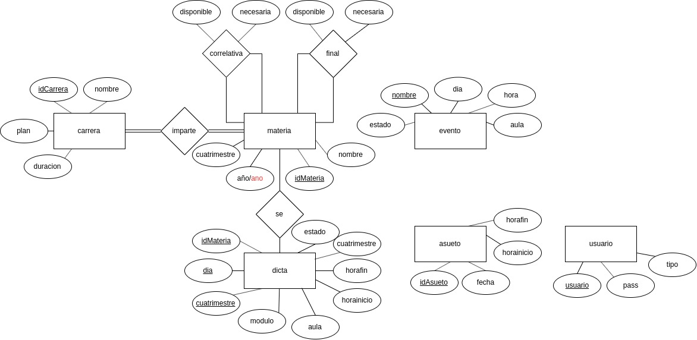

# Cefai app
Desde el Centro de Estudiantes creemos que es necesario que existan algunas aplicaciones para la habituación de los ingresantes a la carrera, además de facilitarle el acceso a información que en un primer momento complicada de encontrar. esta demo echa en su parte con php, y librerías de css y js , permite consultar por las correlativas de una materia y por los horarios del dia.

## Gestion de horarios

una de las aplicaciones del sistema es la de gestionar horarios. Hay dos secciones:

- [Lista de horarios](http://cefai.fi.uncoma.edu.ar/correlativa/horarios/) : listando los horarios del dia actual, y permite consultar por dia.
- [consulta de horarios por materia:](http://cefai.fi.uncoma.edu.ar/correlativa/horarios/mi-semana/) : el cual permite ver los horarios de cada materia seleccionada armando un listado semanal.

## consulta de regimen de correlatividades

otra de las aplicaciones son la de los finales para cursar. esto es algunas materias requieren de finales previos aprobados para ser cursadas.

- lista de cursadas para cursadas: donde le usuario consulta por materia cuales son las materias necesarias para cursarla, y si se cursa esa cuales avilita para cursar.
- lista de finales para cursadas: donde el usuario puede consultar la finales necesarios para cursar esa materia, y si se aprueba es el final de dicha materia si se 

# Configuracion generica del sistema:


tendremos que configurar varias cosas.

- la coneccion a la base de datos
- insertado de carreras, materias, horarios, etc'
- configuracion del frodtend 
- ultimos retoques:

## La Base de Datos

La base de datos tiene una pinta como la siguiente:

 link: [MERbd.jpg](Media/MERbd.jpg)

donde el derivo a tablas queda de la siguiente manera:

---

carrera(**idCarrera**, nombre, plan, duracion)

materia(**idMateria**, nombre, ano, cuatrimestre)

imparte(idCarrera, idMateria)

dicta(**idMateria** , **dia**, **cuatrimestre**, modulo, aula, horainicio, horafin, cuatrimestre, estado )

evento(**nombre**, dia, hora, aula)

asueto(**idAsueto**, horainicio, horafin, fecha)

usuario(**usuario**, pass, tipo)

---

donde tendremos las siguientes consideraciones:

1. la relacion *se* se economiza. usaurio, auseto, evento, no se relacionan entre si para poder evitar sobrecargar el sistema, si se quiera llevar un control de quien crea cosas en el sistema se lo prodria relacionar sencillamente.
2.  dicta tiene un clave compuesta, en la practica yo solo uso la clave compuesta para no agregar duplicados. para eliminar comparo todos los atributos de la tabla.
3. el pass el usuario se le aplica un hash desde el frodtend *md5*.  la contraseña se guarda con
4. hay que tener en cuenta los detalles del frondtend donde tendremos que armar algunas funciones extrar para la carga de algunas materias:


## Conectar a la base de datos:

en la raiz de nuestro sistema tenemos la siguiente archivo: connecion.php

```php
<?php
class coneccion{
    //la clase de PDO conecciona  la BD
    
    public function getConneccion(){
      $usuario = "root";//el usurio
      $contraseña = "";//la contraseña
      $hostName = "localhost";//el nombre del host
      $baseDeDatos = "correlativas";//la base de getDatos
      $coneccion = new PDO("mysql:host=$hostName;dbname=$baseDeDatos;", $usuario, $contraseña);
      return $coneccion;
    }
  }
?>
```

tenemos que modificar la variable `$usaurio` por el usaurio de la base de datos proporcionada, y `$contraseña` por la contraseña de la misma, `$hostname` por el nombre del host que nos proporcionan y `baseDeDatos` que es el nombre de la base de datos que tendremos que crear para poner en funcionamiento al sistema. 

## Cargando la estructura de la base de datos al servidor

Ei contamos con el gesor de bases de datos phpMyAdmin esta tarea sera mas sencilla. solo tendramos que crear la base de datos (la misma que configuarmos anteriormente) para crear la estructura anterior. 

seleccionamos importar y cargamos el sql que se encuentra en /BD/bdGenerica.sql luego de esto tendremos todo el esquema de la base de datos armada.

## Cargando los datos de Carreras, Materias , etc'

Esta es la parte mas dificil explicare dos cosas como insertar datos (el formato sql), y como recrear el generador de sql que diseñe para esta tarea

formato sql Carreras:

```sql
INSERT INTO 'carrera' ('idCarrera', 'nombre', 'plan', 'duracion') VALUES
(NULL, 'nombre carrera', 'plan-n0', 'duracion'),
....,
(NULL,'nombre carrera', 'plan-nn', 'duracion');
```

tenemos que `NULL` permite que ese numero se auto incremente, el el resto de los valores son para el nombre, plan, y la duracion de la carrera.

este mismo formato se realiza para la materias:

```sql
INSERT INTO 'materia'('idMateria', 'nombre', 'ano', 'cuatrimestre') VALUES
(NULL, 'nombre materia', 'año', '1/2'),
...,
(NULL, 'nombre materia', 'año', '1/2');
```

tenemos que NULL permite que la variable se auto incremente, los siguientes datos son para el nombre, el año, y el cuatrimestre.


